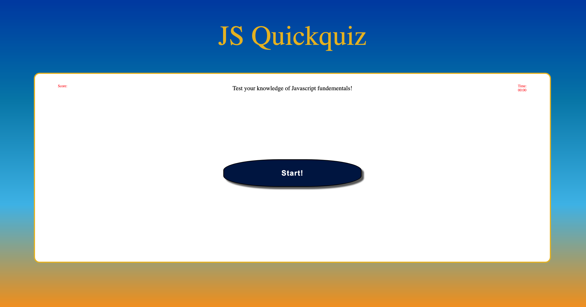

# JS QuickQuiz

### Description
This repo is for the UCLA fullstack program bootcamp, module 4.  
This JS quick quiz is a timed quiz regarding JS fundementals  
The program allows users to save their initals and score into local storage for comparison. 
The module 4 assignment provides the following as a guideline and criteria for the assignment:

### User Story
AS A coding boot camp student 
I WANT to take a timed quiz on JavaScript fundamentals that stores high scores 
SO THAT I can gauge my progress compared to my peers 

### Acceptance Criteria
GIVEN I am taking a code quiz 
WHEN I click the start button 
THEN a timer starts and I am presented with a question 
WHEN I answer a question 
THEN I am presented with another question 
WHEN I answer a question incorrectly 
THEN time is subtracted from the clock 
WHEN all questions are answered or the timer reaches 0 
THEN the game is over 
WHEN the game is over 
THEN I can save my initials and score 

### Links
Deployed Application: https://vulnusr.github.io/CSLockwood-M4-JS-QuickQuiz/

### Screenshot

### Contact

Github: VulnusR 
Gmail: Caleb.lockwood626@gmail.com, Vulnus.Regium@gmail.com